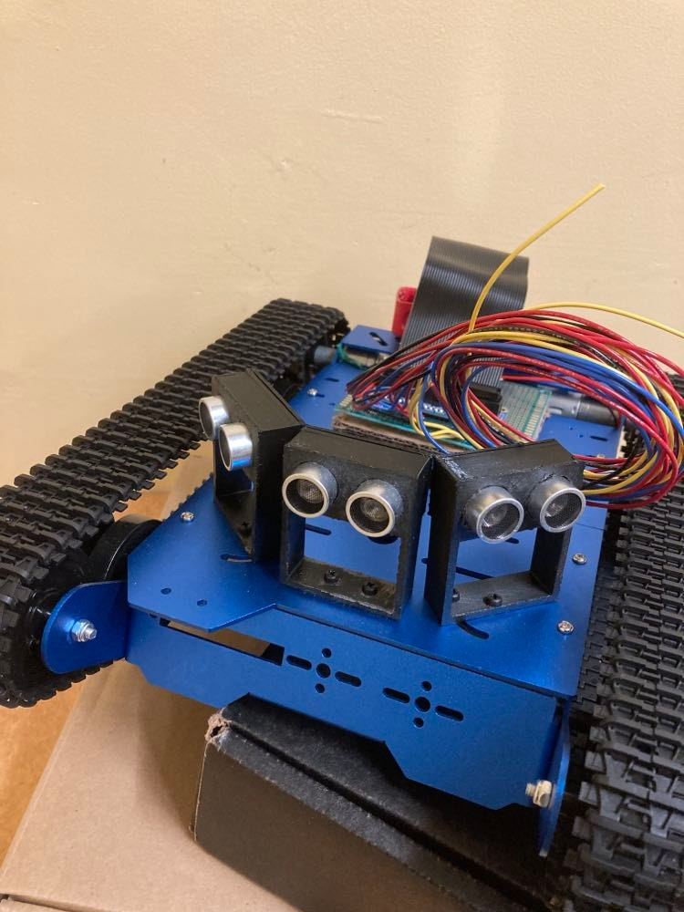

# Memeba

## One Memeba to rule them all 

### 12/16/21

### David Kim (jk2537), Zoltan Csaki (zcc6)

## Objective

People do not have enough memes in their lives, and we wanted to build a robot
that would autonomously find Cornell students and show them memes. This is why
we came up with the Memeba. It is powered by Raspberry Pi and Python, and it
intelligently traverses unmapped environments to avoid obstacles and find people.
Once the Memeba detects a person in front of it, it stops to display the latest
memes from the internet!

## Project Video (TO BE REPLACED WITH THUMBNAIL):

## Introduction

The Memeba is a fully functional self-driving robot that utilizes a wide array
of hardware to display memes to hardworking Cornell students in Duffield Atrium.
It drives around with a tank chassis and uses ultrasonic sensors to avoid
obstacles and a PiCamera to find people to show memes to. The display consists
of an iPad (for sale on apple's website 😂) that connects to the Memeba via a
VNC connection. All of this is run in an embedded system that is fully
controlled by the star of the show, the Raspberry Pi 4.

## Design and Testing

### Concept Design

The first phase of design was planning the robot and coming up with a preliminary design of how we want the Memeba to look and the functionality we wanted it to have.

This is when we decided that we wanted to have a tank tread drive train on the robot, with a sturdy wide base. This was because we needed it to be able to support the weight of an iPad. We also wanted to have the iPad raised up as high as possible so the memes could be easily viewed by people. But through the design process we realized that an iPad raised very high would cause the center of mass of the robot to be high and cause it to be unstable, so we decided on keeping the iPad raised a little above the base, but not mounted on a pole high off the ground.

We decided we did not want to spend too much time designing a mechanical tank chassis ourselves, so we found a [tank chassis on amazon](https://www.amazon.com/Chassis-Aluminum-Arduino-Raspberry-Control/dp/B08QZB5MFR)
that came with motors. We ordered this chassis and assembled it. We had trouble
assembling this with instructions so we are glad we did not choose to design it
ourselves and did not go into mechanical engineering (God forbid...). One thing to note about the design of this tank chassis is that it uses lock nuts on the wheels to allow
them to spin. This confused us at first, because we fully tightened the lock nuts.
This meant that even when we powered the motors, the treads did not spin because
the wheels could not turn. After consulting with Professor Skovira we realized that we just had to loosen the lock nuts. On top this, we had to do further tuning to ensure that both sides of the wheels on the chassis were equally loose in order for the robot to drive straight.

### Ultrasonic Design

The next step of designing the system was to decided on what hardware we wanted to
interface with. We decided to use ultrasonic sensors for obstacle avoidance,
because they are cheap, easy to interface with and have conical area coverage
that allows it to detect large obstacles very easily. We know that ultrasonic
sensors would not perform well on chair legs or small obstacles, but we decided
to constrain the Memeba's use case to hallways and open areas that did not have
small cluttered objects.

After deciding to use ultrasonic sensors we designed and 3D printed ultrasonic
sensor mounts based on a model we found online. In fact we had to re-design and print them again because they were too
low to the robot chassis and due to the conical shape of the ultrasonic waves range, they sometimes picked up the tank treads giving incorrect readings.

### Circuit Design

When designing the Memeba, we decided to do a thorough job with the circuitry and solder all the connections. We knew this was a long term project and that we had to rely on the hardware. If just one wire got unplugged the entire system would fail. So we designed the circuit as below and began soldering.

The circuit design consists of the motor driver we used for Lab 3, wired to the
the two motors that came with the Memeba. After this we attached three
ultrasonic sensors to the Raspberry Pi, each receiving a VCC, GND, input GPIO
and output GPIO pin. Lastly, we had to account for the PiCamera and using the
ribbon cable port.

Soldering turned out to be a huge investment of time. We spent more than 10
hours soldering, which is a lot longer then we expected, but was also lengthened
due to having to debug incorrect pin GPIO output behavior.

On top of this we attempted to cleanly run the
wires under the robot to the motors and ultrasonic sensors by stranding multiple
wires together and using zip ties. This helped us avoid the wire jungle that
most embedded systems prototypes become.

### Circuit Problems

We had two pins that did not work well on the Raspberry Pi and caused us a lot
of problems. The first pin was pin number 5 and the second pin was pin 27. We
found these bugs by extensively using voltmeters to test where the voltages were
not behaving correctly when we were running our code. These pins just outputted
a high voltage when they were initialized and this caused us to have to
re-solder the circuit two times.

When we showed Professor Skovira our design, he also suggested that we used hardware PWM pins in order to control the robot's motors. This would ensure that the linux operating system would not get in the way of the software pwm signal, and that our robot would have a smooth motion. So we researched what pins to use, and re-soldered the motors and re-programmed the pins using pigpio.

### Autonomous Driving Algorithm

When coming up with the autonomous driving algorithm we first did research into
different algorithms that exist for controlling robots. Most of the algorithms
required complicated path planning algorithms and the controllers to follow the
paths. This would have required a large time investment, and we believed that
the performance of our robot would have been bad because we did not have a lot
of high quality sensor information to work with. So we decided to design our own
navigation algorithm, and it ended up working very well.

When designing this algorithm we approached it be thinking through the various
cases we wanted the Memeba to handle, and how we wanted the Memeba to handle
them.

The first case we handled was when the Memeba is very close to objects. If there
was an object close in front of the Memeba, then it needed to rotate in place to
turn and go in a different direction. So we handled this case by always turning
in the direction opposite from the ultrasonic sensor with the closest distances
reading. This implementation first caused the robot to start rotating, and then
rotate immediately in the other direction when the sensor readings changed. We
fixed this by ensuring that the the Memeba would only rotate in one direction
continuously once it entered this case.

The second case we added was that if any of the ultrasonic sensor readings are
very low (less than 10 cm) the robot would back up, because the robot needs
space in order to rotate in place. Originally we did not think we needed this
case, but when testing we noticed that sometimes the Memeba got too close to
obstacles and did not have space to rotate in place and would get stuck. So we
added in this simple drive backwards case.

The next case we worked on was veering. This case would be triggered when there
were objects near the Memeba, but they were not so close that the Memeba needs
to do an in place rotation (between 30 and 100 cm away). When we first tried to
program this we tried to create a veer that was proportional to how much farther
the closest and farthest object are on the left and right side. But this turned
out to be very tricky because the motor power commands we give have a non-linear
correspondence to the motor speed, so using linear proportions did not work. On
top of this is there was nothing on one side of the Memeba the veering would be
so strong that it would be almost in place rotation. So in order to solve
veering we found whether the largest distance reading was to the left or right
of the smallest distance reading on our three sensors. If the largest sensor
reading was to the left of the smallest reading, we veered left and vice versa.
We determined the veer speed by testing and tuning how to set the motor powers
so (ended on 55/100 on the left and 65/100 on the right)

The final case was if there were no obstacles within 1m of the Memeba, in this
case we allowed the Memeba to drive forwards and continue exploration until it
found a more immediate threat.

When running this navigation algorithm, we decided on a response rate of 10Hz
(0.1 second sleep time), because that is what we observed to have the smoothest
performance. If the navigation rate was faster the movement could be jerky, and
if it was slower the Memeba did not react fast enough.

### Human Detection

Similar to the object detection with ultrasonic sensors, we used the PiCamera to
detect people in front of the Memeba. We used OpenCV's DNN library trained on
the COCO dataset to easily identify people with a relatively high confidence. We
referred [to this
tutorial](https://core-electronics.com.au/tutorials/object-identify-raspberry-pi.html)
for the code library we used and examples.

After using the code library we first filtered out what objects we wanted to
detect by passing in the "person" argument to the object detection library as
described in the article.

After this, we also tried to ensure that we would only detect people and show
them memes when they were close enough to the Memeba. If they were too far from
the Memeba we did not want to show them a meme since they would not be close
enough to see it. In order to do this we calculated the area of the bounding box
around the person and determined a threshold for when we should show a meme. If
the area was greater than 1/4 of the camera frame, then we would show them the
meme. This ended up working great because the camera would mostly see peoples
legs due to its low angle, and that would take up a large portion of the frame
when someone was close to the Memeba.

The final step of this was how to integrate the object detection into our code.
When running the object detection camera streaming as in the example it ran very
slowly on the Pi because it was running at 30fps. In order to avoid this, we ran
the object detection streaming at just 1fps, which meant the camera would take 1
image per second to analyze it. This sped the process up 30x and analyzed a
frame for us in about 0.3 seconds on the Pi. This was still not fast enough for
us, because if the robots navigation was paused for 0.3 seconds every second
then that would be enough time for it to miss sensor readings or crash into a
wall. So to avoid this we multi-threaded the object detection code by creating a
class that represented the object detection and held an attribute that told is
if there was a person in the frame or not. In order to run this we created a new
thread using the python threading library, and this thread just ran in the
background constantly taking pictures and running the object detection pipeline
to update the class's state variable depending on if there was a person in the
frame.

### Meme Generation

The meme generation process consisted of sending a GET request to an open-source
meme API on the internet. We would get a random, trending meme scraped from
reddit and download it to the Memeba temporarily. Once the Memeba started, it
held two download slots so that it would go back and forth in showing the other
meme on the iPad display using VNC Viewer (an app that essentially allows you to
use your iPad as a display for the Raspberry Pi). As soon as the meme was
finished displaying, it was overridden with another meme from the API and so the
cycle continued.

### Weaving it All Together

The last step was combining all our navigation code, human detection and meme
generation into one master program. We designed this file similar to the Lab 2
Pygame, where we held a state that the Memeba was in. On top of this, we decided
on the time frame we wanted the Memeba to show memes for, and wanted the Memeba
to drive between showing memes. We decided that the Memeba should show a meme
for a minimum of 5 seconds and a maximum of 10 seconds. We also decided that the
Memeba should turn away from he drive for a minimum of 5 seconds after showing a
meme in order to find someone new. Depending on the current state and the human
detection state, we used some simple control logic to determine if the
navigation loop should be run, or if the Memeba should stop and generate a new
meme.

### Testing

In order to test the Memeba, we let it run around an open space with walls and
stood in front if it every once in a while. We tried to test all the logic in our
code. We caught some important bugs by testing all the cases, such as ensuring
that our navigation system could handle corners.

## Results

Well, after all that hard work, everything better be working! No, but seriously,
we were pleasantly surprised that our final product was almost exactly what we
expected and envisioned our Memeba to be. From our initial conception of the
Memeba diagram to the final product, we had accomplished everything that we had
outlined to do, from object detection to self-driving control to trendy meme
generation.

## Conclusions

This project was very fun and we learned so much about the design process and
our abilities to come up with creative solutions to all the little problems we
faced along the way.

We learned about soldering and how to create clean circuits. We learned about
self driving autonomous algorithms, and the power of designing an algorithm
through testing and refining the code. We also learned about how to use openCV
and how powerful yet simple open source object detection neural networks can be.

Finally we learned that it is important to not always take life so seriously and
sometimes all you need to do is laugh at a meme.

## Future work

The first fix we would make is that we would mount the iPad on the robot a
little better with something more sturdy. We ended up using cables that strapped
the iPad onto the ultrasonic sensor mounts. But this solution allowed the iPad
to shift around, and it happened that the iPad shifted forwards and caused the
ultrasonic sensors to pick it up and believe that there was something right in
front of it. If we had more time, we would 3D print a nice iPad mount that would
look better and be more sturdy.

The biggest failure case of our project was when there were chairs or small
objects in the way of the Memeba, then the Memeba's sensors would not pick up
the objects and the algorithm would fail. We would fix this by using the
PiCamera in our navigation algorithm by using object detection with the camera
and estimating how far the objects are. This would allow us to determine if
there was a table or chair legs in front of the robot and allow our algorithm to
react to small or skinny objects and avoid the area.

## Budget

## References

- Robot Tank Chassis:
  https://www.amazon.com/Chassis-Aluminum-Arduino-Raspberry-Control/dp/B08QZB5MFR
- Raspberry Pi 4 Pin out Diagram:
  https://en.wikipedia.org/wiki/Raspberry_Pi#General_purpose_input-output_(GPIO)_connector
- PiGPIO Hardware PWM Library: http://abyz.me.uk/rpi/pigpio/python.html
- Ultrasonic Sensor Tutorial:
  https://tutorials-raspberrypi.com/raspberry-pi-ultrasonic-sensor-hc-sr04/
- Ultrasonic Sensor Code Library:
  https://gpiozero.readthedocs.io/en/stable/api_input.html
- Ultrasonic Sensor Mount:
  https://www.thingiverse.com/thing:4749179
- OpenCV DNN Tutorial:
  https://core-electronics.com.au/tutorials/object-identify-raspberry-pi.html
- VNC Viewer: https://www.realvnc.com/en/connect/download/viewer/raspberrypi/
- Meme API: https://github.com/D3vd/Meme_Api

## Code Appendix

The GitHub code repository is open source and linked at the top of this page.
